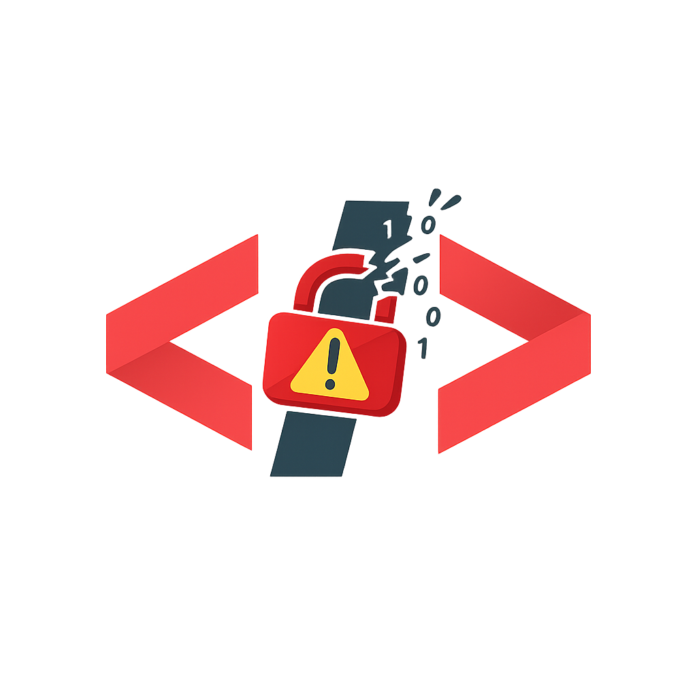

  

# The Damn Vulnerable Codebase

This repository contains a collection of intentionally vulnerable applications written in various programming languages. These samples are designed to demonstrate common security vulnerabilities for testing Static Application Security Testing (SAST) and Software Composition Analysis (SCA) tools.

## ✨ Latest Changes

| Date       | Release Version | Changes                                                                 |
|------------|------------------|-------------------------------------------------------------------------|
| 2025-03-07 | v1.0.0           | Initial release of vulnerable code in different languages.          |
| 2025-03-08 | v1.0.1           | Fixed Python and PHP applications with vulnerable code. Added a Dockerfile for PHP. Added COMPARISON.md in the PHP and Python directories to compare Snyk and Semgrep findings. In future releases, all other directories will be updated.|
| 2026-02-19 | v1.0.2           | Updated the C sample aligning it to C-specific memory safety and integer overflow vulnerabilities. Updated the Go sample to be a coherent intentionally vulnerable app with SQL Injection, XSS, Command Injection, Directory Traversal, Weak Randomness, Hostname Validation Bypass, Timing Side-Channel, ZIP Slip, and plaintext secrets. Updated the Python sample documentation to include the `homomorphic.py` timing side-channel crypto scheme and execution details. |

## 📂 Directory Overview

The table below lists the available vulnerable applications and their associated vulnerabilities:

| Language      | Vulnerabilities |
|--------------|----------------|
| **ASP.NET**  | SQL Injection, XSS, Command Injection, Plaintext Secrets |
| **C**        | Out-of-Bounds Write, Out-of-Bounds Read, Use After Free, Improper Restriction of Operations within the Bounds of a Memory Buffer, NULL Pointer Dereference, Integer Overflow |
| **C++**      | Buffer Overflow, Command Injection |
| **C#**       | SQL Injection, XSS, Command Injection, Plaintext Secrets |
| **Java**     | SQL Injection, XSS, Command Injection, Plaintext Secrets |
| **JavaScript** | SQL Injection, XSS, Command Injection, Plaintext Secrets |
| **Python**   | SQL Injection, XSS, Command Injection, Cryptographic Issues |
| **Groovy**   | SQL Injection, XSS, Command Injection, Plaintext Secrets |
| **PHP**      | SQL Injection, XSS, Command Injection, Plaintext Secrets |
| **TypeScript** | SQL Injection, XSS, Command Injection, Plaintext Secrets |
| **Ruby**     | SQL Injection, XSS, Command Injection, Plaintext Secrets |
| **Go**       | SQL Injection, XSS, Command Injection, Directory Traversal, Weak Randomness, Hostname Validation Bypass, Timing Side-Channel, ZIP Slip, Plaintext Secrets |
| **Perl**     | SQL Injection, XSS, Command Injection, Plaintext Secrets |
| **CoffeeScript** | SQL Injection, XSS, Command Injection, Plaintext Secrets |
| **Dart**     | SQL Injection, XSS, Command Injection, Plaintext Secrets |
| **Scala**    | SQL Injection, XSS, Command Injection, Plaintext Secrets |

## 🔍 Using SAST and SCA Scanners

To analyze vulnerabilities in this repository, use SAST and SCA tools following these steps:

### 1️⃣ Choose Your Tools
Select appropriate SAST and SCA tools based on your security needs:

| Tool Type  | Recommended Tools |
|------------|------------------|
| **SAST**   | SonarQube, Checkmarx, Fortify, Veracode |
| **SCA**    | OWASP Dependency-Check, Snyk, Black Duck |

### 2️⃣ Run SAST Scans
- Configure the SAST tool to scan the root of this directory.
- Identify vulnerabilities in the codebase (e.g., SQL injection, XSS, command injection, buffer overflows).

### 3️⃣ Run SCA Scans
- Use SCA tools to analyze dependencies listed in project files (`package.json`, `pom.xml`, `appsettings.json`, etc.).
- Identify known vulnerabilities and outdated or insecure libraries.

### 4️⃣ Review Reports
- Analyze the generated reports to understand the detected vulnerabilities.
- Prioritize remediation efforts based on severity.

### 5️⃣ Remediation
- Follow the recommended fixes from the SAST and SCA tools.
- Apply secure coding practices and update dependencies where necessary.

## ⚠️ Disclaimer
These applications are intentionally vulnerable and should only be used in a controlled environment for educational purposes. **Do not deploy these applications in a production environment.**
